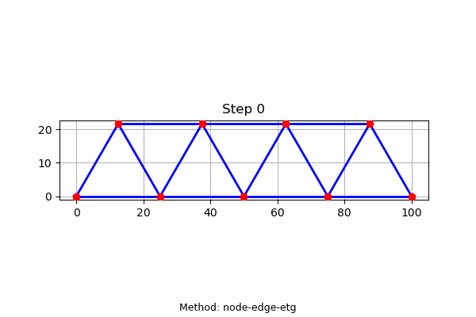

# Cartesian Genetic Programming for Truss Optimization

<p align="center">
  
</p>

This repository contains the Python implementation for the paper: **[EvoDevo: Bioinspired Generative Design via Evolutionary Graph-Based Development](https://doi.org/10.3390/a18080467)**. It specifically focuses on the Cartesian Genetic Programming (CGP) methods discussed in the paper for optimising the design of truss structures.

The project uses an evolutionary algorithm to evolve developmental rules that can alter a starting structure (a "seedling") to improve its performance based on engineering criteria, such as minimising strain energy and volume.

## 📜 About the Project

[cite_start]This work presents a bio-inspired generative design algorithm that uses the concept of evolutionary development (EvoDevo)[cite: 31]. [cite_start]Instead of directly optimising a design, this approach evolves a set of reusable developmental rules[cite: 32].

[cite_start]The core of this system is an artificial Gene Regulatory Network (GRN), which acts as a controller within simple entities called "cells"[cite: 33]. [cite_start]For a truss structure, these cells represent the **nodes** (vertices) and **edges** (members)[cite: 214]. [cite_start]Each cell's GRN senses its local environment (e.g., strain energy, volume) and outputs a "growth" command, such as moving a node or changing an edge's cross-sectional area[cite: 260, 317, 318].

[cite_start]This repository implements the **CGP-based GRN**, which offers more interpretable, "white-box" outputs compared to neural network alternatives like GNNs[cite: 38, 78]. [cite_start]The goal is to evolve a controller that can effectively optimise a truss structure over a series of developmental steps[cite: 83].

## ✨ Key Features

* [cite_start]**Evolutionary Development (EvoDevo)**: An indirect approach to design where the "designer" (the GRN) is evolved, not the design itself[cite: 70].
* [cite_start]**Cartesian Genetic Programming (CGP)**: A graph-based evolutionary algorithm used to create readable and efficient GRN controllers[cite: 172, 179].
* [cite_start]**Cellular Representation**: The truss is broken down into node and edge cells, each with its own controller that makes local decisions to achieve a global objective[cite: 205, 207].
* **Multiple Growth Mechanisms**: The system can optimise trusses by:
    * [cite_start]Adjusting the cross-sectional area of edges (`edge-only` method)[cite: 260].
    * [cite_start]Moving the coordinates of nodes (`node-only` method)[cite: 260].
    * [cite_start]Doing both simultaneously (`node-edge` method)[cite: 610].
* [cite_start]**Fitness Function**: The evolutionary algorithm optimises controllers based on a fitness score that combines the total strain energy and total volume of the truss[cite: 363].

## 🔧 Getting Started

### Prerequisites

This project uses **Conda** to manage its environment and dependencies. You'll need to have Anaconda or Miniconda installed.

### Installation

1.  **Clone the repository:**
    ```bash
    git clone [https://github.com/Tahernezhad/Cartesian-Genetic-Programming-for-Truss-Optimization.git](https://github.com/Tahernezhad/Cartesian-Genetic-Programming-for-Truss-Optimization.git)
    cd Cartesian-Genetic-Programming-for-Truss-Optimization
    ```

2.  **Create the Conda environment:**
    Use the provided `environment.yml` file to create the Conda environment. This will install all the necessary packages and dependencies.
    ```bash
    conda env create -f environment.yml
    ```

3.  **Activate the environment:**
    ```bash
    conda activate cgp
    ```

### Running the Experiment

To run the evolutionary algorithm, execute the `main.py` script:

```bash
python main.py
