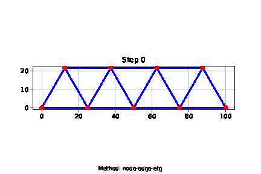

# Cartesian Genetic Programming for Truss Optimization

<p align="center">
  
</p>

This repository contains the Python implementation for the paper: **[EvoDevo: Bioinspired Generative Design via Evolutionary Graph-Based Development](https://doi.org/10.3390/a18080467)** as part of [RIED](https://riedesign.org/) project. It specifically focuses on the Cartesian Genetic Programming (CGP) methods discussed in the paper for optimising the design of truss structures.

## 📜 About the Project

This work presents a bio-inspired generative design algorithm that uses the concept of evolutionary development (EvoDevo). Instead of directly optimising a design, this approach evolves a set of reusable developmental rules.

The core of this system is an artificial Gene Regulatory Network (GRN), which acts as a controller within simple entities called "cells". For a truss structure, these cells represent the **nodes** (vertices) and **edges** (members). Each cell's GRN senses its local environment (e.g., strain energy, volume) and outputs a "growth" command, such as moving a node or changing an edge's cross-sectional area.

This repository implements the **CGP-based GRN**, which offers more interpretable, "white-box" outputs compared to neural network alternatives like GNNs. The goal is to evolve a controller that can effectively optimise a truss structure over a series of developmental steps.

## ✨ Key Features

* **Evolutionary Development (EvoDevo)**: An indirect approach to design where the "designer" (the GRN) is evolved, not the design itself.
* **Cartesian Genetic Programming (CGP)**: A graph-based evolutionary algorithm used to create readable and efficient GRN controllers.
* **Cellular Representation**: The truss is broken down into node and edge cells, each with its own controller that makes local decisions to achieve a global objective.
* **Multiple Growth Mechanisms**: The system can optimise trusses by:
    * Adjusting the cross-sectional area of edges (`edge-only` method).
    * Moving the coordinates of nodes (`node-only` method).
    * Doing both simultaneously (`node-edge` method).
* **Fitness Function**: The evolutionary algorithm optimises controllers based on a fitness score that combines the total strain energy and total volume of the truss.

## 🌐 Graph-Based Neighborhood Awareness

Truss structure is naturally represented as a graph, where joints are **nodes** and structural members are **edges**. In the naive CGP, the controller makes developmental decisions in isolation, relying only on its own local state.

However, physical structures rely on local connectivity and load distribution. To better capture this behavior, the system also implements neighborhood-aware developmental modes that allow nodes and edges to "communicate" by sensing the states of their connected neighbors. By leveraging the adjacency matrix of the graph, the CGP controller can generate more interpretable equations that reflect true local interactions.

This repository includes two advanced graph-based methods:

* **Neighbor-Aware Growth (`node-edge-etg-with-neighbors`)**: The controller updates a component by looking at its own state plus the *average* state of its directly connected neighbors. For edges, this means sensing the average strain and volume of adjacent members. For nodes, it senses the average coordinates of connected joints.
* **Advanced Statistical Aggregators (`node-edge-etg-advanced-agg`)**: This method expands the neighborhood sensing by feeding comprehensive statistical data into the GRN. Alongside the component's own state, the CGP controller receives the *minimum, maximum, average, and standard deviation* of the surrounding neighbors' properties (e.g., neighboring strain distributions or coordinate ranges).

These additions allow the Cartesian Genetic Programming algorithm to discover interpretable, white-box rules that intrinsically understand the structural topology, leading to smarter evolutionary development.

## 🔧 Getting Started

### Prerequisites

This project uses **Conda** to manage its environment and dependencies. You'll need to have Anaconda or Miniconda installed.

### Installation

1.  **Clone the repository:**
    ```bash
    git clone [https://github.com/Tahernezhad/Cartesian-Genetic-Programming-for-Truss-Optimization.git](https://github.com/Tahernezhad/Cartesian-Genetic-Programming-for-Truss-Optimization.git)
    cd Cartesian-Genetic-Programming-for-Truss-Optimization
    ```

2.  **Create the Conda environment:**
    Use the provided `environment.yml` file to create the Conda environment. This will install all the necessary packages and dependencies.
    ```bash
    conda env create -f environment.yml
    ```

3.  **Activate the environment:**
    ```bash
    conda activate cgp
    ```

### Running the Experiment

To run the evolutionary algorithm, execute the `main.py` script:

```bash
python main.py
```

## Acknowledgements

Environment modelling concepts originate from the **RIED** project (GitLab): https://gitlab.com/riedproject

- [HAL-CGP](https://happy-algorithms-league.github.io/hal-cgp/)
---
